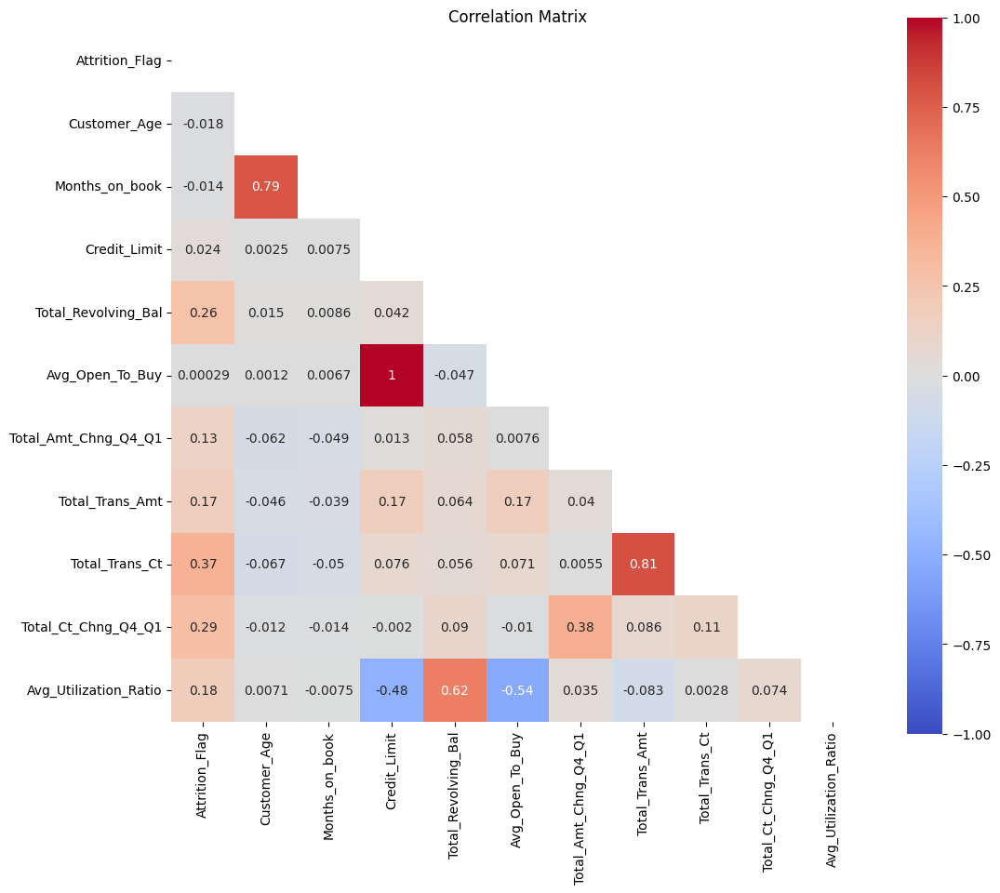

# Churn Prediction

## Project Overview

This project focuses on predicting customer churn for a major financial institution concerned with increasing client retention among credit card users. The objective is to analyze customer data to predict which clients are likely to discontinue services and to identify clusters of clients for targeted marketing strategies.

### Type of Challenge

- **Consolidation**
- **Duration**: 5 days
- **Deadline**: 08/05/2024, 4:30 PM
- **Team Challenge**: Solo project

## Mission Objectives

- Build machine learning models for classification.
- Select and justify the choice of performance metrics.
- Tune model parameters for optimal performance.
- Analyze and report on model performance and data insights.

## Installation

To run this project, you will need to install several Python libraries. It is recommended to use a virtual environment. Here's how to set it up and install the required packages:

```bash
# Create a virtual environment (optional)
python -m venv venv

# Activate the virtual environment
# On Windows
venv\Scripts\activate
# On Unix or MacOS
source venv/bin/activate

# Install the required packages
pip install -r requirements.txt
```

## Usage

To run the analysis and view the churn prediction models, execute the main script or notebooks:

```bash
python main.py  # For a script-based approach
```

or

```bash
jupyter notebook churn_prediction_notebook.ipynb  # For Jupyter notebook
```

## Data Sources

The dataset used in this project can be downloaded from the following link:

- [Credit Card Customers](https://www.kaggle.com/datasets/sakshigoyal7/credit-card-customers)

## Visuals





## Contributors

Yanina Andriienko

## Timeline

This project was completed in 5 days.

## Personal Situation
